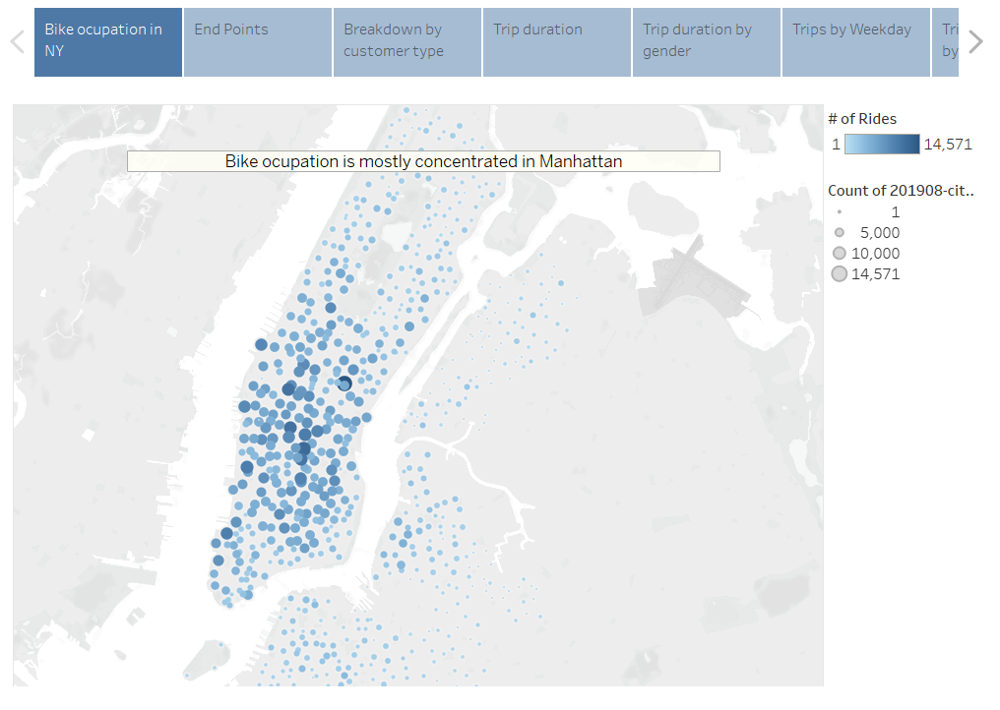
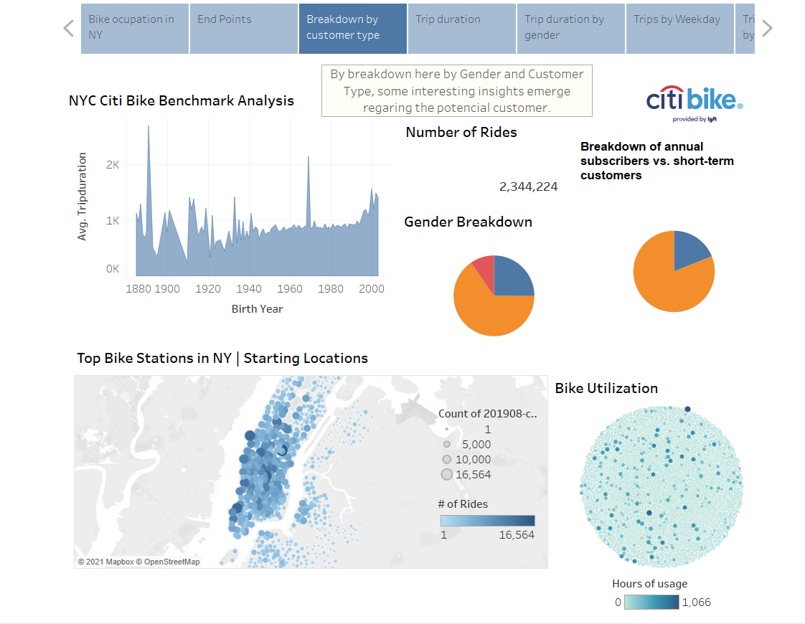
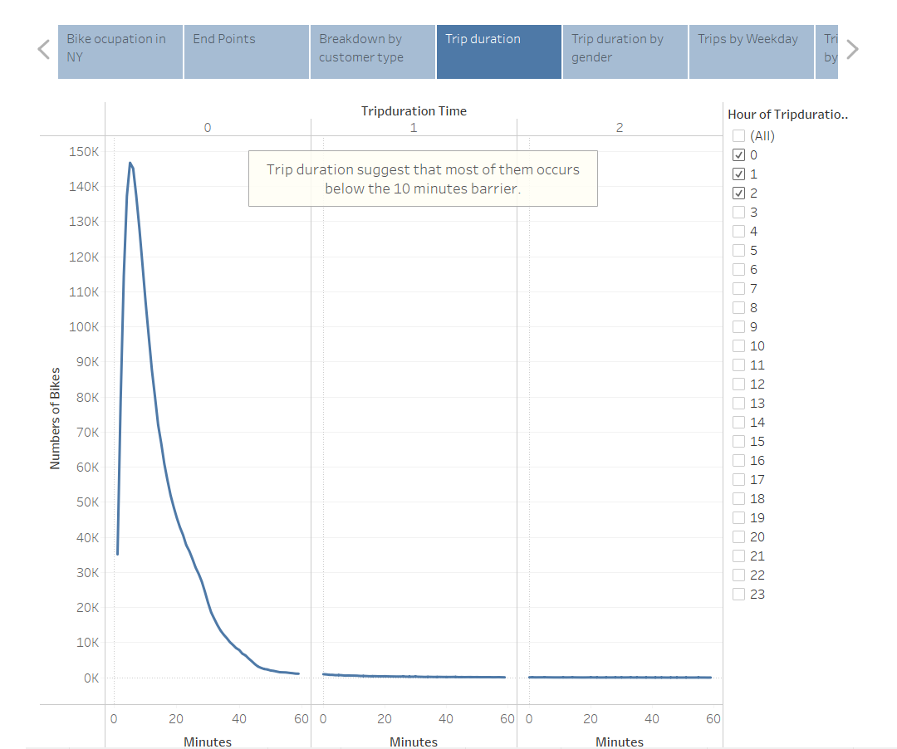
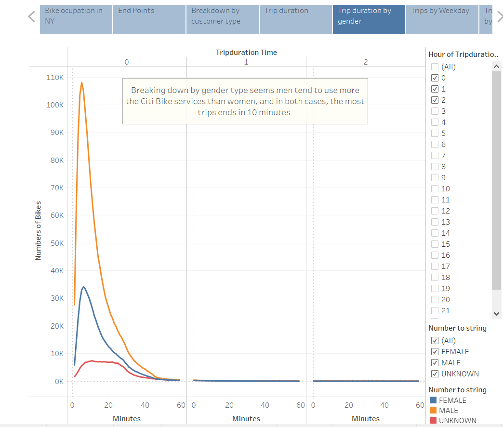
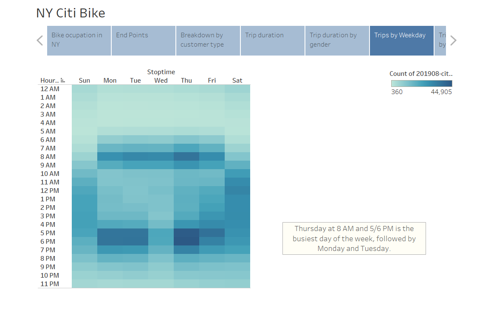
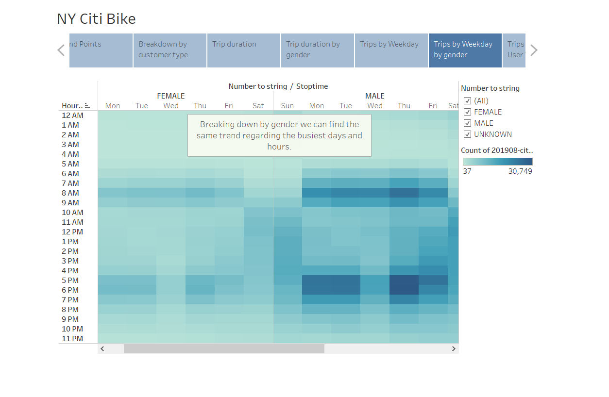
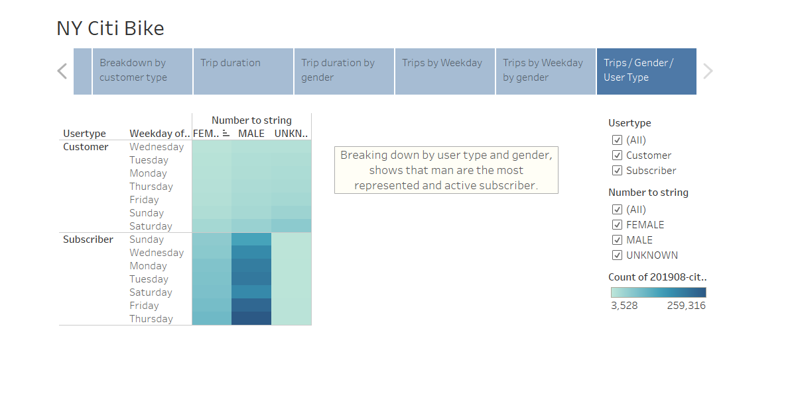

# bikesharing

Analysis of Citi Bike program in New York, using data visualization tool Tableau

For further information and future updates see [data input](https://ride.citibikenyc.com/system-data).

To see full dashboard in Tableau please visit: [link](https://public.tableau.com/app/profile/endeavor.intelligence/viz/StoryChallengeCitiBikeERR/Story1#1).

- Visualization with Tableau:

- Dashboard to generate some insights regarding the user type:

- Trip duration layer:

- Trip duration breakdown by gender type:

- Trips by Weekday:

- Trips by Weekday breaking down by gender type:

- Trips by Weekday breaking down by gender and user type:

## Summary

There are a few improvements on this analysis, for example with the data set and the pricing model described in the [webpage](https://ride.citibikenyc.com/pricing) we can have a good benchmark for our market research regarding average expenditure and potential revenues. Since NY is a big developed city this analysis should be extrapolated to small cities with more distances and usually with less adoption of this kind of model.
